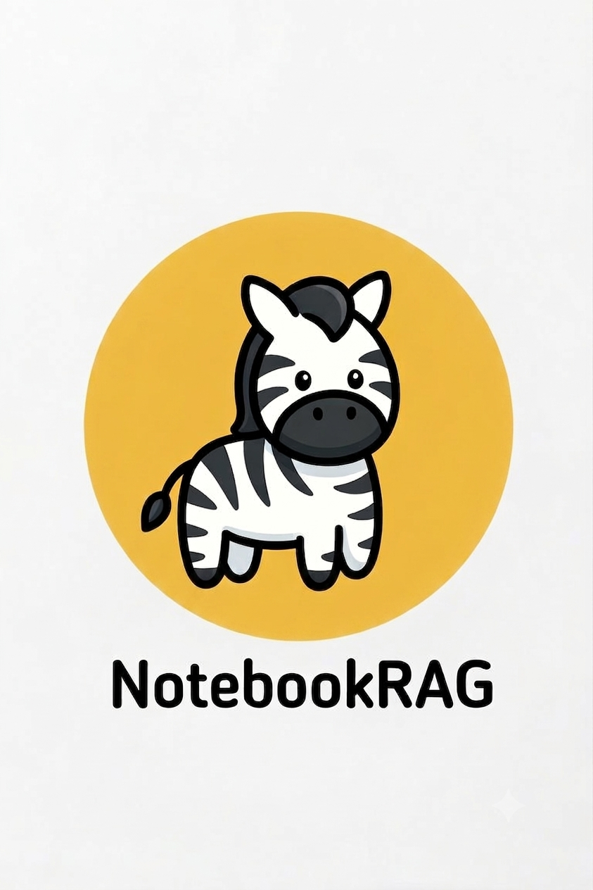
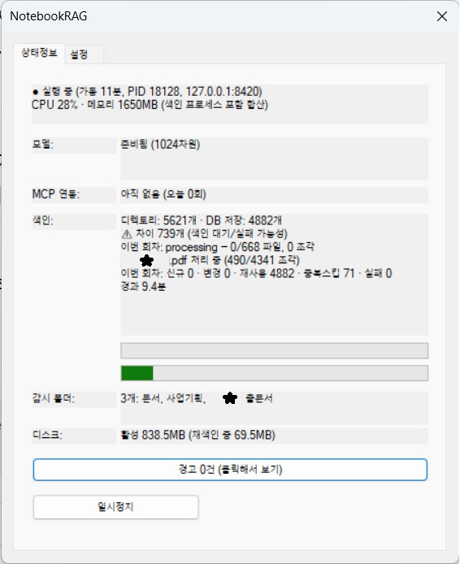

# NotebookRAG

<p align="center">
  
</p>

내 컴퓨터 안의 문서를 로컬에서 검색하고, Claude Code 등 MCP를 지원하는 AI 도구에서 자연어로 질문할 수 있게 해주는 Windows용 개인 문서 검색 도구입니다.

**문서는 컴퓨터 밖으로 절대 나가지 않습니다.** 문서 이해(임베딩)와 검색 모두 여러분의 컴퓨터 안에서만 처리됩니다.

---

## 실제 화면

트레이 아이콘을 클릭하면 뜨는 상태 창입니다 — 색인 진행 상황, 디렉토리/DB 파일 수 비교, CPU·메모리 사용량을 실시간으로 보여줍니다.

<p align="center">
  
</p>

---

## 왜 만들었나

직장인의 노트북에는 몇 년 치 문서가 정리 안 된 채 쌓여 있는 경우가 많습니다. 어떤 파일이 최신본인지, 어디에 뭐가 있는지 기억하기 어렵고, 검색은 파일명이나 폴더 구조에 의존할 수밖에 없습니다.

기업용 RAG(검색 증강 생성) 솔루션은 많지만, 대부분 "회사 조직"을 대상으로 하지 "개인 노트북의 어수선한 문서함"을 대상으로 하지 않습니다. NotebookRAG는 그 빈틈을 채우려는 개인 프로젝트입니다 — 의미 기반 검색(파일명이 아니라 내용으로 찾기)과 완전한 로컬 프라이버시를 개인 사용자 규모에서 제공합니다.

## 특징

- **완전 로컬 처리** — 임베딩(bge-m3)과 벡터 검색(sqlite-vec) 모두 컴퓨터 안에서 실행. 인터넷 연결은 최초 모델 다운로드 시에만 필요.
- **백그라운드에서 조용히 색인** — CPU 사용률을 낮게 유지하도록 최적화되어, 다른 작업을 하는 동안 방해 없이 천천히 색인이 진행됩니다.
- **MCP 표준 지원** — Claude Code를 비롯해 MCP(Model Context Protocol)를 지원하는 어떤 AI 도구에서도 연동 가능합니다(MCP는 개방형 프로토콜입니다).
- **이중 요약 없음** — MCP로 연동된 AI 클라이언트가 이미 언어모델이므로, NotebookRAG는 검색된 원문을 그대로 반환합니다. 별도 API 키가 필요 없습니다.
- **트레이 앱으로 상태 확인** — 색인 진행 상황, 디스크 사용량, 검색 연동 상태를 트레이 아이콘에서 바로 확인·제어할 수 있습니다.
- **관리자 권한 불필요** — 설치부터 실행까지 일반 사용자 권한만으로 동작합니다(회사 노트북 환경 고려).

## 지원 파일 형식

| 형식 | 확장자 |
|---|---|
| 한글(HWP) | `.hwp`, `.hwpx` |
| Word | `.docx` |
| PowerPoint | `.pptx` |
| PDF | `.pdf` |
| 텍스트/마크다운 | `.txt`, `.md` |

## 특정 파일·폴더 색인에서 제외하기

노트북 안의 모든 파일이 검색 대상이 될 필요는 없습니다 — 대용량 참고 자료, 중복 백업 파일 등은 `.ragignore` 규칙으로 제외할 수 있습니다.

**트레이 앱에서 편집하기** (권장): 설정 탭에서 감시 중인 폴더의 **[규칙]** 버튼을 누르면, 그 폴더에 적용될 제외 패턴을 바로 편집할 수 있습니다.

**직접 파일로 관리하기**: 감시 폴더 바로 아래에 `.ragignore` 파일을 만들어 한 줄에 규칙 하나씩 적습니다.

```
# 주석은 #으로 시작
임시폴더           # 폴더명이 정확히 일치하면 제외
*임시*             # 파일/폴더명에 "임시"가 포함되면 제외
*.msi
*최종*_v[0-9]*     # 예: "계약서_최종_v2.docx" 같은 중복 파일 패턴
```

## 설치

1. [Releases](../../releases) 페이지에서 최신 설치 파일(`NotebookRAG_Setup.exe`)을 다운로드합니다.
2. 실행해 설치를 진행합니다(관리자 권한 불필요, 사용자 폴더에 설치됩니다).
3. 설치가 끝나면 임베딩 모델(bge-m3, 약 600MB)이 자동으로 다운로드됩니다 — 인터넷 연결이 필요합니다.
4. 트레이 아이콘(설정 탭)에서 검색할 문서 폴더를 추가합니다.
5. 설치 완료 시 뜨는 안내에 따라 Claude Code에 등록합니다:
   ```
   claude mcp add NotebookRAG -s user -- "<설치경로>\bin\mcp-rag\mcp-rag.exe"
   ```
6. Claude Code에서 "내 문서에서 OOO 찾아줘"라고 물어보면 끝입니다.

> ⚠️ 코드 서명 인증서가 아직 없어 설치 시 Windows SmartScreen 경고가 나타날 수 있습니다. "추가 정보 → 실행"으로 진행하시면 됩니다.

## 요구 사항

- Windows 10/11
- 디스크 여유 공간 약 1.3GB (프로그램 + 모델 파일)
- 인터넷 연결(최초 모델 다운로드 시에만)
- MCP를 지원하는 AI 클라이언트(Claude Code 등)

## 현재 버전(v1.1.0)의 알려진 제한사항

- 한국어 UI만 지원합니다.
- 코드 서명이 없어 SmartScreen 경고가 표시됩니다.
- 대부분 개발자 개인 컴퓨터 환경에서 검증되었으며, 완전히 새로운(가상머신) 환경에서의 검증은 부분적입니다.
- `.hwpx`는 합성 테스트 위주로 검증되어, 실제 문서 다양성에서 예외가 있을 수 있습니다.

## 기술 스택

- 임베딩: [bge-m3](https://huggingface.co/ggml-org/bge-m3-Q8_0-GGUF) via `llama-cpp-python` (MIT 라이선스)
- 벡터 검색: `sqlite-vec`
- 서버: Python(FastAPI) + PyInstaller로 패키징
- 트레이 앱: C++/MFC (네이티브 Windows)
- MCP 브릿지: Python (`mcp` 패키지)
- HWP 파싱: `pyhwp`

## 라이선스

<!-- TODO: 라이선스 확정 필요 — MIT을 검토 중입니다.
  ⚠️ HWP(.hwp) 지원에 쓰인 pyhwp(hwp5) 패키지가 AGPLv3+ 라이선스입니다.
  MIT으로 확정하기 전에 이 의존성과의 호환성을 검토할 것 — 현재는 개인/
  내부 사용 목적으로만 번들된 상태(2026-08-23). -->
- 임베딩/검색/서버 코드: 확정 예정(MIT 검토 중)
- HWP(.hwp) 파싱: [pyhwp](https://github.com/mete0r/pyhwp) — **AGPLv3 or later**

## 기여

이슈/PR 환영합니다. 이 프로젝트의 개발 과정(색인 안정성 문제, 메모리 최적화, 데이터 안전장치 설계 등)은 별도로 정리해 공유할 예정입니다.
